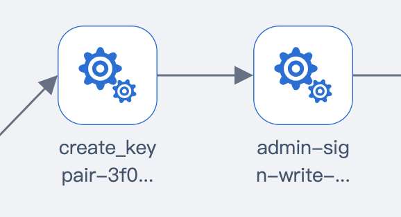
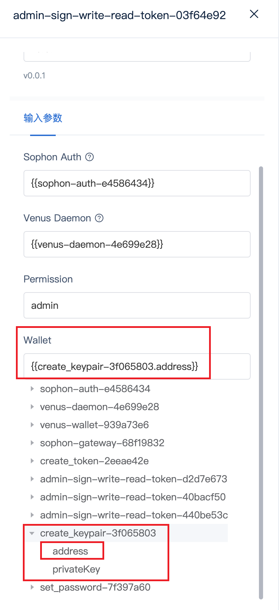

## 插件开发流程

1. 根据测试用例文档编写测试插件代码
- 可以参考现存的venus插件
2. 测试插件代码参考模版
- 模版固定的内容无需改动，只需要填充自定义内容
- 多个插件间参数传递规则
3. 编译插件
4. 在页面上传编译后的插件，创建job验证测试插件功能

## 根据测试用例文档编写测试插件代码

```go
package main

import (
	"context"

	"github.com/ipfs-force-community/brightbird/env"
	"github.com/ipfs-force-community/brightbird/env/plugin"
	"github.com/ipfs-force-community/brightbird/types"
	"github.com/ipfs-force-community/brightbird/version"
)

func main() {
	plugin.SetupPluginFromStdin(Info, Exec)
}

// 插件信息
var Info = types.PluginInfo{
	Name:        "{{plugin_name}}", // 替换为你的插件名称
	Version:     version.Version(),
	PluginType:  types.TestExec,
	Description: "{{plugin_description}}", // 替换为您的插件描述
}

// RenderParams 定义了渲染参数结构体
type RenderParams struct {
	Config

	NameSpace       string
	PrivateRegistry string
	Args            []string

	UniqueId string
}

// 在执行时需要使用的插件参数
type TestCaseParams struct {
	// 定义需要使用的插件参数
}

// 插件的执行逻辑
func Exec(ctx context.Context, k8sEnv *env.K8sEnvDeployer, params TestCaseParams) error {
	// 编写你的代码逻辑
	// 注意将单独的功能抽象为函数
	return nil
}
```

测试插件编写原则：
1. 单一职责：每个插件尽量只测试一个单独的功能
2. 最小化原则：每个测试插件功能最小化
3. 参照模板：模板中{{}}标注的内容是需要手动填写的，其他框架部分无需修改

下面是venus的创建user测试插件可以参考：
```go
package main

import (
	"context"
	"fmt"

	"github.com/ipfs-force-community/brightbird/env"
	"github.com/ipfs-force-community/brightbird/env/plugin"
	"github.com/ipfs-force-community/brightbird/types"
	"github.com/ipfs-force-community/brightbird/version"
	"github.com/ipfs-force-community/sophon-auth/auth"
	"github.com/ipfs-force-community/sophon-auth/core"
	"github.com/ipfs-force-community/sophon-auth/jwtclient"

	sophonauth "github.com/ipfs-force-community/brightbird/pluginsrc/deploy/sophon-auth"
)

func main() {
	plugin.SetupPluginFromStdin(Info, Exec)
}

var Info = types.PluginInfo{
	Name:        "create_user",
	Version:     version.Version(),
	PluginType:  types.TestExec,
	Description: "创建用户",
}

type TestCaseParams struct {
	Auth     sophonauth.SophonAuthDeployReturn `json:"SophonAuth" jsonschema:"SophonAuth" title:"Sophon Auth" require:"true" description:"sophon auth return"`
	UserName string                            `json:"userName" jsonschema:"userName" title:"UserName" require:"true" description:"token user name"`
	Comment  string                            `json:"commnet" jsonschema:"comment" title:"Commnet" description:"commnet for user"`
}

type CreateUserReturn struct {
	UserName string `json:"userName" jsonschema:"userName" title:"UserName" require:"true" description:"user name in sophon auth"`
}

func Exec(ctx context.Context, k8sEnv *env.K8sEnvDeployer, params TestCaseParams) (*CreateUserReturn, error) {
	authAPIClient, err := jwtclient.NewAuthClient(params.Auth.SvcEndpoint.ToHTTP(), params.Auth.AdminToken)
	if err != nil {
		return nil, err
	}

	if len(params.UserName) == 0 {
		return nil, fmt.Errorf("username cant be empty")
	}

	user, err := authAPIClient.CreateUser(ctx, &auth.CreateUserRequest{
		Name:    params.UserName,
		Comment: &params.Comment,
		State:   core.UserStateEnabled,
	})
	if err != nil {
		return nil, err
	}

	fmt.Println(user.Name)
	return &CreateUserReturn{
		UserName: user.Name,
	}, nil
}

```

## 插件间参数传递如何定义input和output？
<div align="center">
  
</div>
需求：我希望通过“create_key_pair“创建的wallet address传递给admin插件，address作为前一个插件的输出参数，传递给下一个插件作为输入参数，这个需求如何实现？


1. 作为输出参数
```go
// 定义输出类型
// 定义字段名和字段类型，CreateKeyPair包含两个参数
type CreateKeyPair struct {
	Address    address.Address `json:"address" jsonschema:"address" title:"Address" require:"true" description:"address created"`
	PrivateKey string          `json:"privateKey" jsonschema:"privateKey" title:"Private Key" require:"true" description:"private key created"`
}

func Exec(ctx context.Context, k8sEnv *env.K8sEnvDeployer, params TestCaseParams) (*CreateKeyPair, error) {
	...

// 使用CreateKeyPair作为输出类型，并且给参数赋值
	return &CreateKeyPair{
		Address:    walletAddr,
		PrivateKey: hex.EncodeToString(kiBytes),
	}, nil
}

```


2. 作为输入参数
```go

// 定义输入参数需要Wallet
type TestCaseParams struct {
	....
	Wallet     address.Address                   `json:"wallet" jsonschema:"wallet" title:"Wallet" require:"true" description:""`
	
}

func checkPermission(ctx context.Context, token string, params TestCaseParams) (string, error) {
	....

	// 使用wallet参数
	writeErr := chainRPC.MpoolPublishByAddr(ctx, params.Wallet)


	return "", nil
}
```

3. 页面上如何选择配置？
<div align="center">
  
</div>

在admin这个插件的wallet输入框，选择在create_pair定义的“create_keypair-3f065803.address”作为输入参数。

使用address而不是create_pair作为输出参数，是因为接收参数定义的是**address.Address**类型，这里输入输出的类型必须一致。

```go
type TestCaseParams struct {
	....
	Wallet     address.Address                   `json:"wallet" jsonschema:"wallet" title:"Wallet" require:"true" description:""`
	
}
```