

  

<h1 align="center">brightbird 用户手册使用指南</h1>

  
  
    
  
   

brightbird 测试平台通允许用户独自上传测试插件,并且根据测试插件相互的传参和依赖,编辑任何出想要的测试流程.最后通过 Job 触发的管理来实现对大多数据后端程序的测试

---

## 完整流程图

  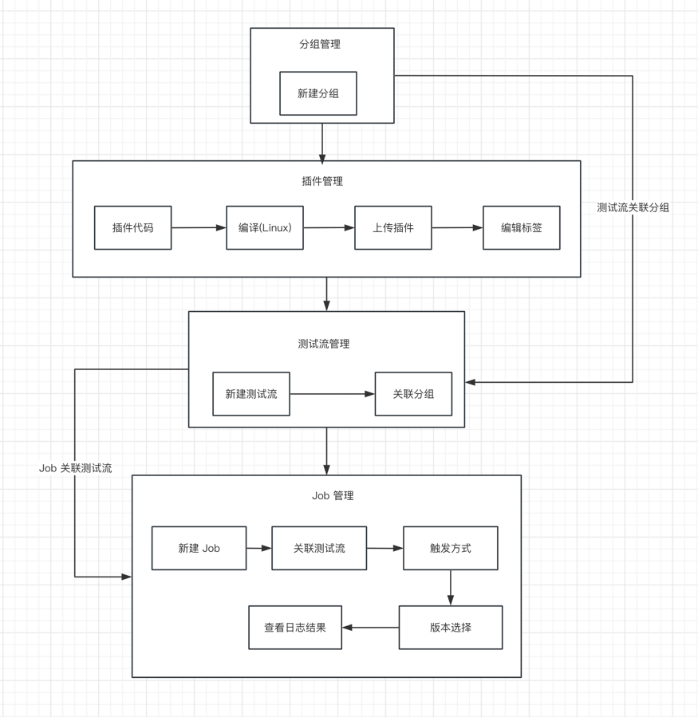

[TOC]

## 分组管理

> 分组管理可以对测试流进行分类,方便于后续的使用,例如新建一个"主网测试流分组",那么这个分组仅用于后续的主网测

* 分组列表

  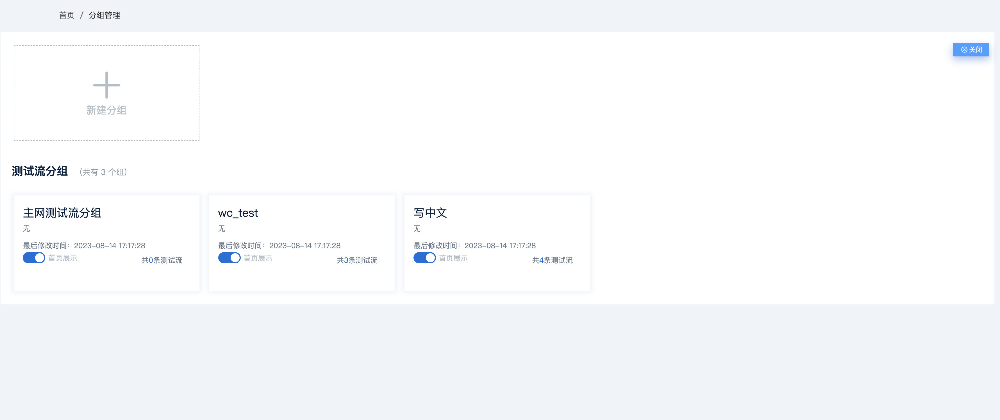

* 新建分组

  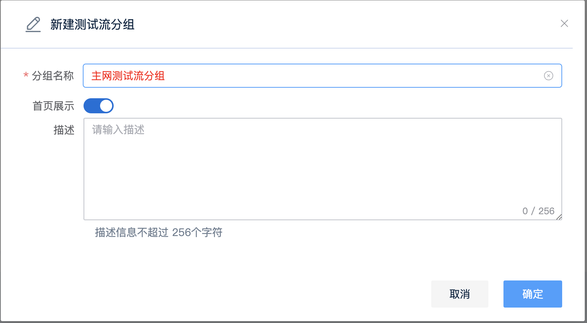

## 本地节点

* 插件列表

> 插件列表分为测试插件和部署插件
>
> 部署插件:需要测试的组件
>
> 测试插件:对部署组件进行测试的插件

  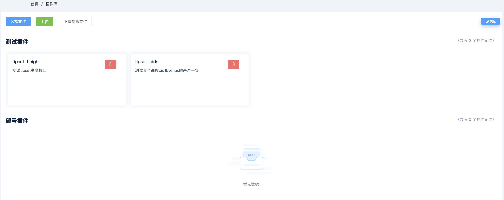

* 插件上传

> 上传的插件必须是 Linux 系统可执行的,GO 语言可以通过 `CGO_ENABLED=0 GOOS=linux GOARCH=amd64 go build main.go` 在mac 上编译出 Linux 程序
>
> 点击选择文件进入到待上传列表,点击上传做最终提交,系统会根据测试用例的结构判断上传的代码是测试插件或者部署插件

* 插件详情

> 点击插件详情可以查看插件的详细信息
>
> 标签功能可以对插件进行分类,用户可以直接添加或者修改标签,并且在测试流编辑页面可以直接搜索标签查询出所有想要的标签类别

  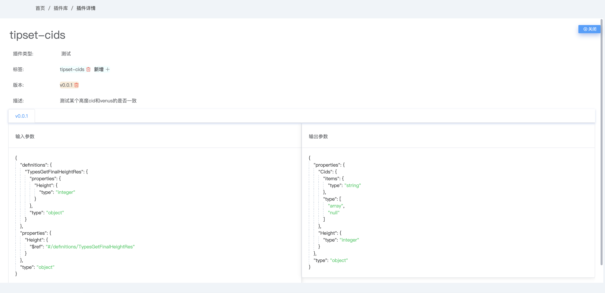

## 图形项目

* 测试流编辑

> 通过用户组合测试插件的形式,可以实现大多数场景的测试
>
> 搜索 : 模糊匹配,也可以直接搜索标签,或者插件名称
>
> 插件链接 : 鼠标移动到测试插件的边缘会出现标记,点击鼠标对插件进行连接
>
> 运行顺序 : 先执行的插件链接后执行的插件,通过连线的方式来决定执行的先后顺序,所以整体的连线要保证正确
>
> 

  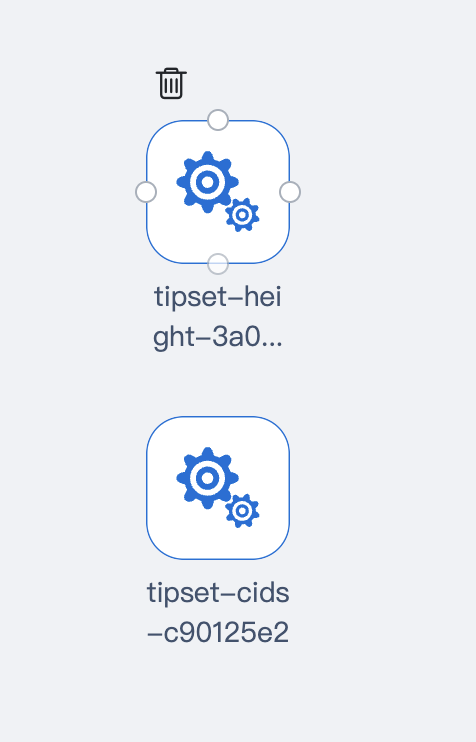

* 插件依赖选择

> 测试插件相互依赖的情况下,可以点击插件,选择输入参数和输出参数
>
> 如果依赖插件返回结果中的具体某一个值可以点击 > 展开选择
>
> 系统会自动给每一个测试插件分配唯一的 UUID,如果依赖的插件存在多个,通过 UUID 来决定被使用者

  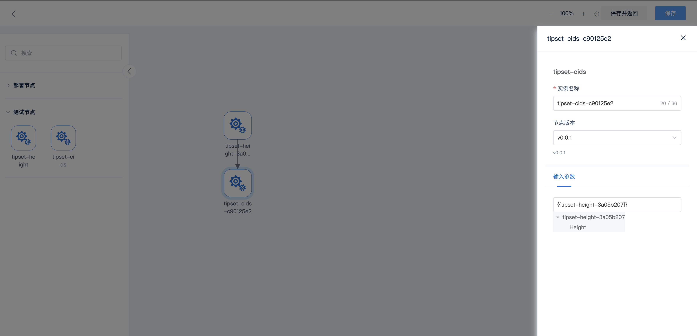

* 保存测试流

> 编辑测试流名称,选择关联的分组,填写描述,点击确定保存

  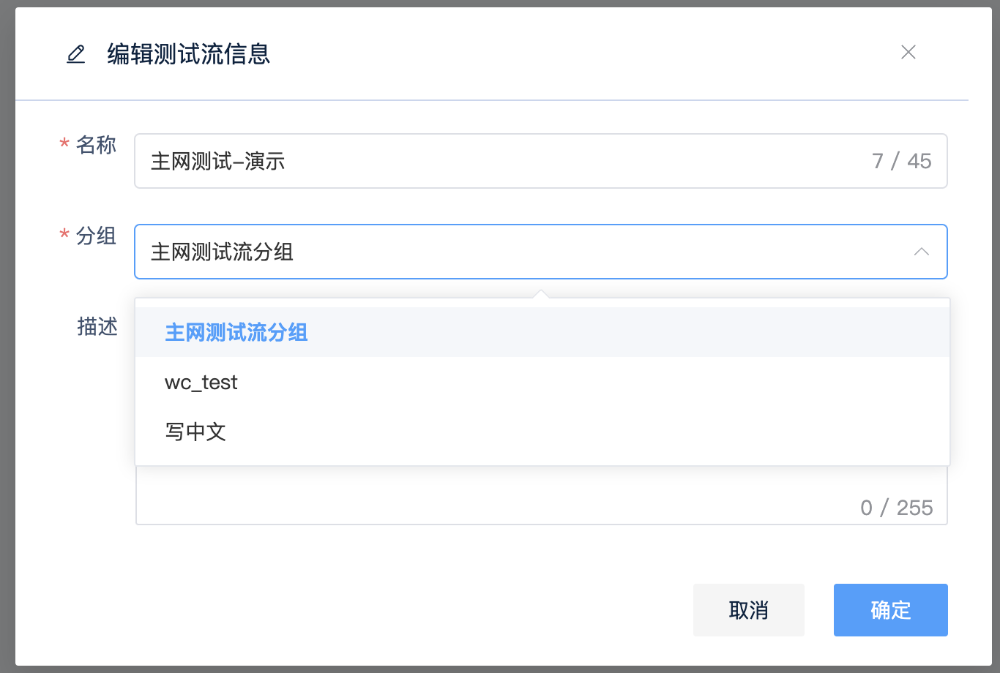

* 测试流列表

> 测试流列表页面可以对测试流进行修改,查看,删除操作

  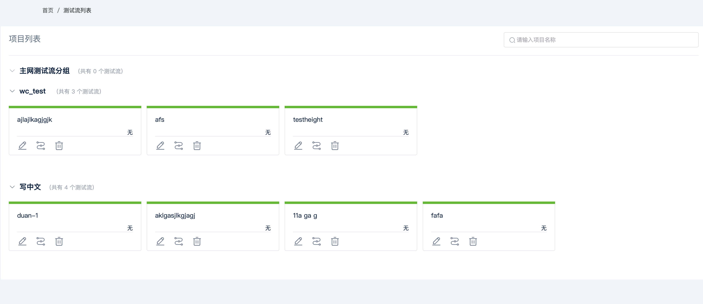

## Job 管理

* 新建 Job

> 选择触发的分组,对应的测试流
>
> 通过Job 的方式来决定触发哪一个测试流和触发的方式
>
> cron_job 逻辑: 分 时 日 月 星期,具体使用方法请查阅 cron_job 信息
>
> 另外两种触发类型 : pr_merged_hook , tag_created_hook

  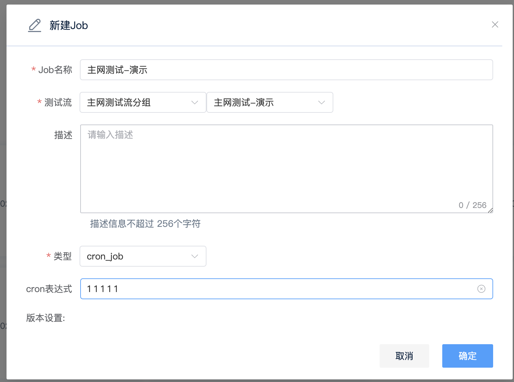

* Job 管理

> Job 管理页面可以对所有的 Job 进行手动触发,修改,删除操作

  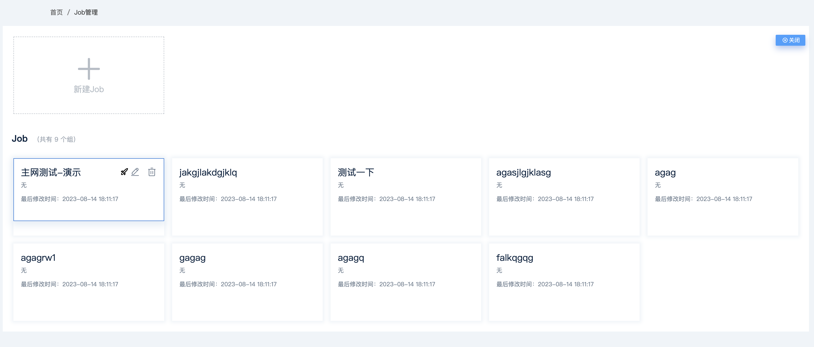

* Job 触发列表页

> 点击 Job 名称进入 Job 触发列表页

## 日志查询

* Job 日志

> 通过点击 Job 列表页面信息查看具体日志
>
> 绿色表示测试通过
>
> 红色表示测试未通过

  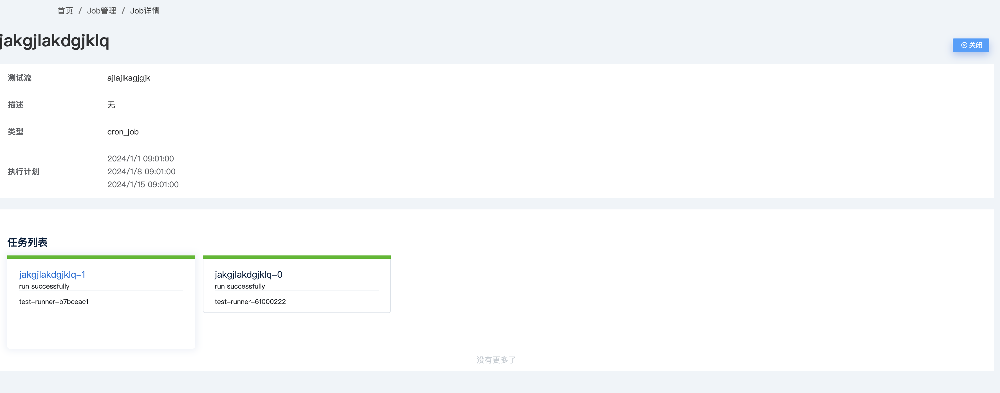

* 日志信息

> 点击 Job 名称进入日志详情列表页
>
> 点击名称可展开日志
>
> 通过浏览器搜索关键字查询

  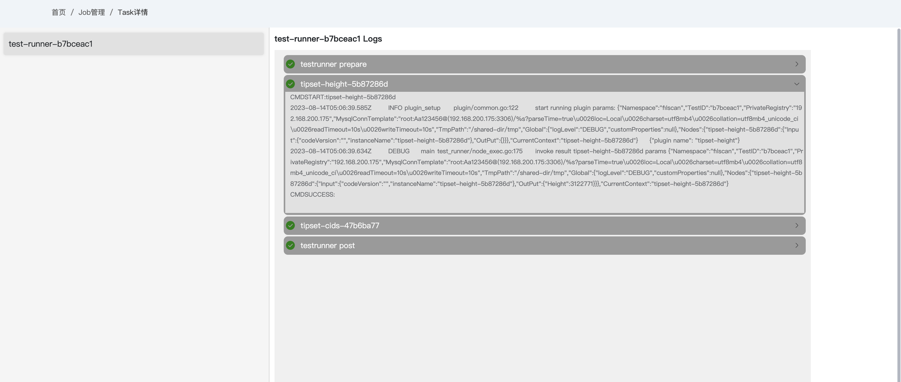

